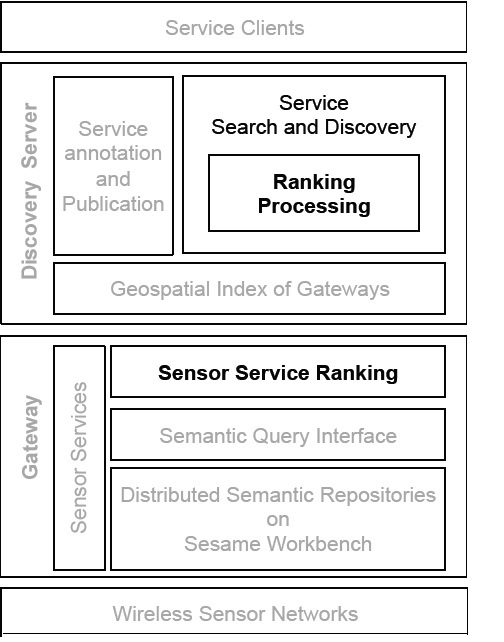

# Sensor Service Discovery and Ranking

## Concept

The concept of sensing-as-a-service is proposed to enable a unified way of accessing and controlling sensing devices for many Internet of Things based applications. Existing techniques for Web service computing are not sufficient for this class of services that are exposed by resource-constrained devices. The vast number of distributed and redundantly deployed sensors necessitate specialised techniques for their discovery and ranking. Current research in this line mostly focuses on discovery, e.g., designing efficient searching methods by exploiting the geographical properties of sensing devices. The problem of ranking, which aims to prioritise semantically equivalent sensor services returned by the discovery process, has not been adequately studied. Existing methods mostly leverage the information directly associated with sensor services, such as detailed service descriptions or quality of service information. However, assuming the availability of such information for sensor services is often unrealistic. 

We propose a ranking strategy by estimating the cost of accessing sensor services. The computation is based on properties of the sensor nodes as well as the relevant contextual information extracted from the service access process. The evaluation results demonstrate not only the superior performance of the proposed method in terms of ranking quality measure, but also the potential for preserving the energy of the sensor nodes.

## Datasets
The dataset consists of 100 gateways distributed over 22 different locations around the University of Surrey. 100 sensor services of different types (e.g., temperature, light, and windspeed) are generated for each gateway, which results in a total number of 10,000 services. A semantic repository is constructed on each of the gateways to store the semantic descriptions of the services. 
* [Dataset for Discovery mechanism experiments](./Dataset-discovery/RTreeEvalDataset)
* [Dataset for Ranking mechanism experiments](./Dataset-ranking)
## [Ontologies](./Ontologies)
The ontology files needed to view the dataset files.
## [Sample Simulation and Evaluation code](./Code/uk)
Code to simulate the discovery and ranking mechanism and execute the evaluation experiments on the datasets.

